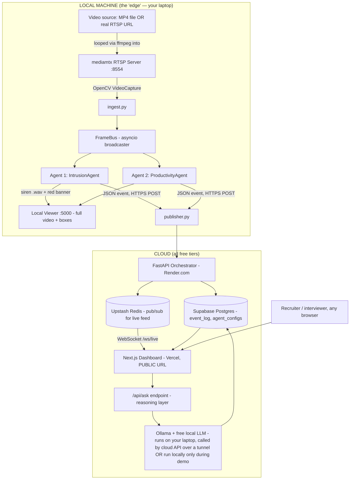

# AgentGrid — Multi-Agent Edge Video Intelligence Platform

AgentGrid is an edge-native, privacy-preserving video intelligence platform that mirrors enterprise split-AI architectures. Instead of streaming continuous high-bandwidth video to the cloud, AgentGrid processes raw video feeds locally at the edge (on-site) using lightweight deep learning models, forwarding only structured JSON metadata events to a central cloud dashboard.

---

## System Architecture



---

## Technical Stack

| Layer | Exact Tool | License/Cost | Purpose |
|---|---|---|---|
| Language | Python 3.11 | Free, open-source | All backend and AI code |
| Object Detection | Ultralytics YOLOv8s (`yolov8s.pt`) | Free, AGPL-3.0 (via `ultralytics` pip package) | Person/object detection for Intrusion Agent |
| Pose Estimation | Ultralytics YOLOv8s-pose (`yolov8s-pose.pt`) | Free, AGPL-3.0 | Skeleton keypoint extraction for Productivity Agent |
| Camera simulation | mediamtx (latest release binary) | Free, open-source (MIT) | Turns a video file into a real RTSP stream |
| Stream looping | ffmpeg | Free, open-source (LGPL/GPL) | Feeds video file into mediamtx continuously |
| Frame processing | opencv-python | Free, open-source | Reading frames, drawing boxes/zones, computing zone overlap |
| Backend/API framework | FastAPI + Uvicorn | Free, open-source (MIT) | Orchestrator API, WebSocket server |
| Local viewer | OpenCV `cv2.imshow` | Free, open-source | Displays the full local video feed with overlays |
| Event bus | Redis, hosted via Upstash free tier | Free tier: 10,000 commands/day, 256MB | Real-time pub/sub from cloud API to public dashboard |
| Database | PostgreSQL, hosted via Supabase free tier | Free tier: 500MB storage, unlimited API requests | Stores `event_log` and `agent_configs` tables |
| Reasoning LLM | Ollama running a small free open model, e.g. `deepseek-r1:1.5b` | Free, open-source, runs entirely on local hardware, no API key | Powers "Ask Your Cameras" natural-language answers |
| Backend hosting | Render.com (free Web Service, Docker)* | Free CPU tier | Hosts the FastAPI orchestrator publicly |
| Frontend hosting | Vercel | Free hobby tier | Hosts the Next.js public dashboard |
| Alarm sound | Any short `.wav`/`.mp3` siren/beep from Pixabay Sound Effects or Freesound.org | Free, royalty-free | Local audible alert on intrusion |
| Video sources | Pexels, Pixabay (stock footage); public government traffic camera feeds; self-recorded footage | Free, royalty-free/legal | Test footage for both agents |
| Containerization | Docker + Docker Compose | Free (Docker Desktop, personal use) | Cloud API + dashboard deployment |
| Version control | Git + GitHub (public repo) | Free | Code hosting, portfolio visibility |

*\*Note: Render.com was substituted for Hugging Face Spaces due to a Hugging Face platform policy change requiring payment for the Docker SDK.*

---

## Edge Architecture & Unified Tracking

AgentGrid is built on a unified local edge tracking pipeline:

1. **VideoCaptureThread**: Decodes the RTSP stream in a dedicated background thread to prevent OpenCV I/O buffering from blocking processing loops.
2. **FrameBus**: An asyncio-based message broker that distributes decoded video frames and tracking results concurrently to multiple independent AI agents.
3. **Shared Single-Model Tracking**: A single `YOLOv8s-pose.pt` model is loaded once in `ingest.py` and runs `model.track()` with `persist=True` on each frame. The resulting detections and track IDs are broadcast to all agents via FrameBus, ensuring consistent identity tracking across agents while avoiding redundant inference.
4. **Multi-Agent Execution**:
   - **IntrusionAgent**: Checks tracked person positions against a per-video polygon zone and active hour window. Plays a siren and emits `intrusion` events on violation. Supports a 3-second cooldown between alarms.
   - **ProductivityAgent**: Extracts skeletal keypoints (shoulders, wrists, hips) from tracked persons and computes displacement over a rolling 30-second window. Classifies state as `active`, `idle`, or `away`. Emits a 300-second stability alert (siren + red banner) when a person remains stationary for ≥5 minutes.

---

## Project Structure

```
├── camera_sim/                          # Camera simulation utilities
│   ├── start_stream.sh                   # Launches mediamtx + ffmpeg loop
│   └── sample_videos/                    # Stock footage (CCTV1.mp4, OFFICE.mp4)
├── cloud_api/                            # FastAPI cloud orchestrator
│   ├── main.py                           # REST + WebSocket endpoints
│   ├── db.py                             # Supabase PostgreSQL connection pool + CRUD
│   ├── models.py                         # Pydantic schemas (Event, AgentConfig, etc.)
│   ├── redis_bus.py                      # Upstash Redis async pub/sub client
│   ├── ask_agent.py                      # Two-step "Ask Your Cameras" reasoning pipeline
│   ├── test_live.html                    # Standalone WebSocket test page
│   ├── Dockerfile
│   └── requirements.txt
├── dashboard/                            # Next.js 14 TypeScript dashboard
│   ├── app/
│   │   ├── components/
│   │   │   ├── AgentToggle.tsx            # Agent on/off toggle per camera
│   │   │   ├── LiveEventFeed.tsx          # Real-time WebSocket event feed
│   │   │   ├── AddCameraForm.tsx          # Register new RTSP cameras
│   │   │   ├── AskCamerasBox.tsx          # Chat-style "Ask Your Cameras" UI
│   │   │   └── DemoClips.tsx              # Tabbed pre-recorded demo video player
│   │   ├── page.tsx
│   │   └── layout.tsx
│   ├── Dockerfile
│   └── package.json
├── local/                                # Edge processing modules
│   ├── ingest.py                         # Main entry: RTSP capture + shared model + agents
│   ├── frame_bus.py                      # Async FrameBus (pub/sub for frame distribution)
│   ├── publisher.py                      # Publishes JSON events to cloud API
│   ├── benchmark_bandwidth.py            # 300-second bandwidth comparison tool
│   ├── day1_test.py                      # Minimal YOLOv8 person detection baseline
│   ├── sounds/siren.wav                  # Audible alarm for intrusion alerts
│   └── agents/
│       ├── base_agent.py                 # Abstract base with emit_event()
│       ├── intrusion_agent.py            # YOLOv8 person detection + polygon zone check
│       └── productivity_agent.py         # YOLOv8-pose skeletal tracking + activity state
├── extract_frame.py                      # Extract a single frame for zone-point picking
├── pick_zone_points.py                   # Click polygon points on an image to define zones
├── AgentGrid_Dashboard.html              # Standalone static HTML dashboard mockup
├── docker-compose.yml                    # Multi-service setup (cloud_api + dashboard)
├── mediamtx / mediamtx.yml               # RTSP server binary + full config
├── .env.example                          # Environment variable template
├── Tutorial.md                           # Step-by-step setup guide
└── yolov8s.pt / yolov8s-pose.pt         # YOLOv8 model weights
```

---

## Video Source Selection & Multi-Zone Support

`ingest.py` prompts the user at startup to choose between two pre-configured video sources, each with its own restricted zone polygon:

| Choice | Stream | RTSP URL | Camera ID | Zone Polygon |
|---|---|---|---|---|
| 1 | CCTV1 Counter | `rtsp://localhost:8554/cctv1` | `cctv1_cam` | Triangle near counter |
| 2 | Office Desk | `rtsp://localhost:8554/office` | `office_cam` | Quadrilateral over desk area |

Additional streams can be added by modifying the zone polygons in `ingest.py:57-75`.

---

## Bandwidth & Model Speed Benchmarking Tools

### 1. Network Bandwidth Benchmark
[`local/benchmark_bandwidth.py`](local/benchmark_bandwidth.py) runs a 300-second automated comparison:
- **Phase 1**: Captures raw RTSP video bandwidth by measuring loopback interface bytes via `psutil` while reading frames with OpenCV.
- **Phase 2**: Measures event-only bandwidth by reading `event_bytes.log` (written by `publisher.py` for each POSTed event).
- Results are saved to `local/benchmark_results.json` with savings percentage, hourly/daily extrapolations, and hardware identification.

This empirically demonstrates the split-AI architecture's bandwidth reduction (typically ~99.99%).

### 2. Edge Model Speed Benchmark
[`local/benchmark_model_speed.py`](local/benchmark_model_speed.py) compares local execution latency and throughput of the baseline PyTorch `.pt` model against optimized formats (ONNX and CoreML):
- **Exporting**: Automatically exports `yolov8s-pose.pt` to `yolov8s-pose.onnx` and `yolov8s-pose.mlpackage` (CoreML) via the Ultralytics engine.
- **Evaluation**: Reads 300 frames from the local test video (`camera_sim/sample_videos/CCTV1.mp4`), warms up the inference runtimes, and measures the average inference latency (ms/frame) and FPS using `time.perf_counter()`.
- **ONNX Execution**: Runs direct inference via `onnxruntime` using manual frame resizing, channel transposition, and normalization.
- **CoreML Execution**: Runs direct inference via `coremltools` (`ct.models.MLModel`), executing prediction requests on the target Apple Silicon Neural Engine (ANE).
- Results are appended to `local/benchmark_results.json`.

*(Note: Real-world benchmarking on Apple Silicon M4 shows the following exact performance characteristics for YOLOv8s-Pose: PyTorch CPU baseline runs at 43.60 ms/frame (22.94 FPS), ONNX CPU runs at 72.12 ms/frame (13.86 FPS), and CoreML Neural Engine runs at 19.80 ms/frame (50.50 FPS). CoreML achieves a ~2.2x speedup over PyTorch and a ~3.6x speedup over ONNX, demonstrating that edge-native hardware compilation is highly relevant for Apple Silicon edge devices).*

---

## Zone Configuration Utilities

- **`extract_frame.py`**: Extracts frame #61 from `CCTV1.mp4` (skips initial black frames) and saves as `test_frame.png`.
- **`pick_zone_points.py`**: Loads `test_frame.png` in an interactive matplotlib window. Click points to define a polygon, then copy the coordinates into `ingest.py` for a custom restricted zone.

---

## Environment Variables

| Variable | Required | Default | Purpose |
|---|---|---|---|
| `DATABASE_URL` | Yes | — | Supabase PostgreSQL connection string |
| `REDIS_URL` | Yes | — | Upstash Redis connection string (TLS via `rediss://`) |
| `OLLAMA_URL` | No | `http://localhost:11434` | Local Ollama instance URL |
| `PORT` | No | `8333` | FastAPI server port |

`OLLAMA_URL` includes Docker fallback logic — if `localhost` is unreachable, `ask_agent.py` automatically retries with `host.docker.internal` for containerized deployments.

---

## Docker Compose

```yaml
services:
  cloud_api:   # FastAPI on port 8333
  dashboard:   # Next.js on port 3333, depends on cloud_api
```

The edge processing stack (ingest.py, mediamtx, ffmpeg) runs natively on the host — only the cloud services are containerized.

---

## Cloud API Endpoints

| Method | Path | Description |
|---|---|---|
| GET | `/health` | Database connectivity health check |
| POST | `/api/events` | Receive and persist JSON event from edge agents |
| GET | `/api/events?limit=N` | Retrieve recent events |
| WS | `/ws/live` | WebSocket streaming live events via Redis pub/sub |
| GET | `/api/agents` | List all agent configurations |
| POST | `/api/agents/{camera_id}/{agent_name}/toggle` | Enable/disable an agent per camera |
| GET | `/api/cameras` | List all registered cameras |
| POST | `/api/cameras` | Register a new camera |
| POST | `/api/ask` | Natural-language question (two-step reasoning pipeline) |

---

## "Ask Your Cameras" Reasoning Pipeline

1. **`filter_events()`**: Parses natural language for camera names, agent types, and time keywords (`today`, `yesterday`, `last night`). Constructs a parameterized SQL query against `event_log`.
2. **`ask_ollama()`**: Sends filtered events + question to a local Ollama instance (`deepseek-r1:1.5b`) for summarization. Strips `<think>...</think>` reasoning blocks from responses. Falls back to 20 most recent events if no filter matches.

---

## Local vs. Cloud Video Split

| Where | URL (example) | What's shown | Video included? |
|---|---|---|---|
| Local viewer | OpenCV window | Full live video with bounding boxes, zone overlays, pose skeletons, alarm banner | **Yes — full video** |
| Public cloud dashboard | `https://agentgrid.vercel.app` | Camera list, agent toggle grid, live text event feed, "Ask Your Cameras" box, 2-3 short pre-recorded demo clips/GIFs labeled as such, bandwidth-comparison widget | **No live video — text/events + pre-recorded clips only** |

*This split exists because continuously streaming live video to a public server 24/7 requires paid bandwidth/compute that free tiers do not provide — this is the same real-world cost constraint that motivates commercial split-AI architecture.*

---

## Legal & Ethical Video Sourcing Policy

> [!IMPORTANT]
> Only use video from: (1) royalty-free stock footage sites (Pexels, Pixabay), (2) footage you personally record, or (3) publicly and intentionally published government/municipal traffic camera feeds. Do NOT use footage or streams sourced from websites aggregating unsecured/unintentionally-exposed private CCTV cameras, regardless of ease of access — this applies for both ethical and legal reasons and is especially important given this project is meant to demonstrate privacy-conscious engineering judgment.
