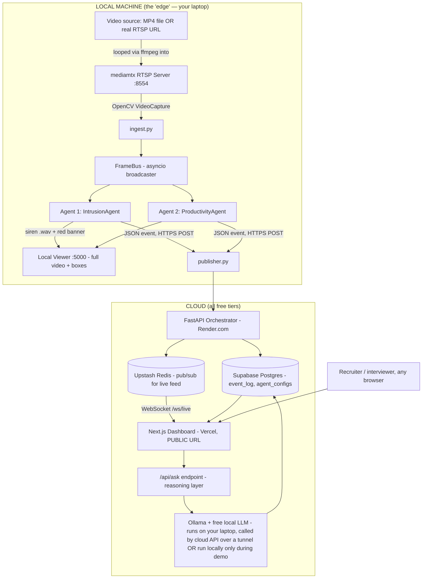

# AgentGrid — Multi-Agent Edge Video Intelligence Platform

AgentGrid is an edge-native, privacy-preserving video intelligence platform that mirrors enterprise split-AI architectures. Instead of streaming continuous high-bandwidth video to the cloud, AgentGrid processes raw video feeds locally at the edge (on-site) using lightweight deep learning models, forwarding only structured JSON metadata events to a central cloud dashboard.

---

## Part 2 — System Architecture

---

## Part 3 — Technical Stack

| Layer | Exact Tool | License/Cost | Purpose |
|---|---|---|---|
| Language | Python 3.11 | Free, open-source | All backend and AI code |
| Object Detection | Ultralytics YOLOv8s (`yolov8s.pt`) | Free, AGPL-3.0 (via `ultralytics` pip package) | Person/object detection for Intrusion Agent |
| Pose Estimation | Ultralytics YOLOv8s-pose (`yolov8s-pose.pt`) | Free, AGPL-3.0 | Skeleton keypoint extraction for Productivity Agent |
| Camera simulation | mediamtx (latest release binary) | Free, open-source (MIT) | Turns a video file into a real RTSP stream |
| Stream looping | ffmpeg | Free, open-source (LGPL/GPL) | Feeds video file into mediamtx continuously |
| Frame processing | opencv-python | Free, open-source | Reading frames, drawing boxes/zones, computing zone overlap |
| Backend/API framework | FastAPI + Uvicorn | Free, open-source (MIT) | Orchestrator API, WebSocket server |
| Local viewer | Flask OR FastAPI (same framework, separate small app) | Free, open-source | Serves the full local video feed with overlays on `localhost:5000` |
| Event bus | Redis, hosted via Upstash free tier | Free tier: 10,000 commands/day, 256MB | Real-time pub/sub from cloud API to public dashboard |
| Database | PostgreSQL, hosted via Supabase free tier | Free tier: 500MB storage, unlimited API requests | Stores `event_log` and `agent_configs` tables |
| Reasoning LLM | Ollama running a small free open model, e.g. `llama3.2:1b` or `phi3:mini` | Free, open-source, runs entirely on local hardware, no API key | Powers "Ask Your Cameras" natural-language answers |
| Backend hosting | Render.com (free Web Service, Docker)* | Free CPU tier | Hosts the FastAPI orchestrator publicly |
| Frontend hosting | Vercel | Free hobby tier | Hosts the Next.js public dashboard |
| Alarm sound | Any short `.wav`/`.mp3` siren/beep from Pixabay Sound Effects or Freesound.org | Free, royalty-free | Local audible alert on intrusion |
| Video sources | Pexels, Pixabay (stock footage); public government traffic camera feeds; self-recorded footage | Free, royalty-free/legal | Test footage for both agents |
| Containerization | Docker + Docker Compose | Free (Docker Desktop, personal use) | Local dev parity with cloud deployment |
| Version control | Git + GitHub (public repo) | Free | Code hosting, portfolio visibility |

*\*Note: Render.com was substituted for Hugging Face Spaces due to a Hugging Face platform policy change requiring payment for the Docker SDK.*

---

## Edge Architecture & Unified Tracking

AgentGrid is built on a unified local edge tracking pipeline:
1. **VideoCaptureThread**: Decodes the RTSP stream in a dedicated async worker thread to prevent OpenCV I/O buffering from blocking processing loops.
2. **FrameBus**: An asyncio-based message broker that distributes decoded video frames concurrently to multiple independent AI agents without redrawing or duplicating frames.
3. **Multi-Agent Execution**: 
   - **IntrusionAgent**: Tracks objects against a polygon zone check and active hour window.
   - **ProductivityAgent**: Extracts skeletal coordinates using `yolov8s-pose.pt` and tracks motion displacement over a rolling 30-second window.

---

## Part 6.2/6.3 Scope Limitation

> [!WARNING]
> This agent measures presence and motion within a zone over time. It does NOT measure work quality, output, or effort, and must never be described as "measuring how hard someone is working."

---

## Part 8 — Local vs. Cloud Video Split

| Where | URL (example) | What's shown | Video included? |
|---|---|---|---|
| Local viewer | `http://localhost:5000` | Full live video with bounding boxes, zone overlays, pose skeletons, alarm banner | **Yes — full video** |
| Public cloud dashboard | `https://agentgrid.vercel.app` | Camera list, agent toggle grid, live text event feed, "Ask Your Cameras" box, 2-3 short pre-recorded demo clips/GIFs labeled as such, bandwidth-comparison widget | **No live video — text/events + pre-recorded clips only** |

*This split exists because continuously streaming live video to a public server 24/7 requires paid bandwidth/compute that free tiers do not provide — this is the same real-world cost constraint that motivates commercial split-AI architecture.*

---

## Part 10 — Legal & Ethical Video Sourcing Policy

> [!IMPORTANT]
> Only use video from: (1) royalty-free stock footage sites (Pexels, Pixabay), (2) footage you personally record, or (3) publicly and intentionally published government/municipal traffic camera feeds. Do NOT use footage or streams sourced from websites aggregating unsecured/unintentionally-exposed private CCTV cameras, regardless of ease of access — this applies for both ethical and legal reasons and is especially important given this project is meant to demonstrate privacy-conscious engineering judgment.
