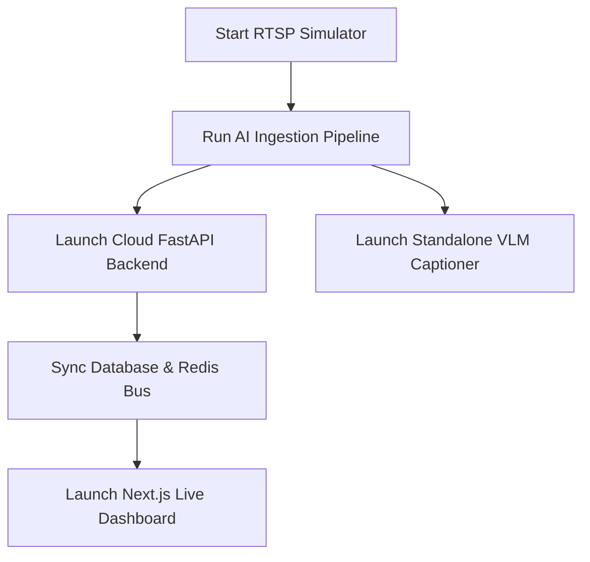

# 🚀 AgentGrid: Complete Operational Runbook & Feature Walkthrough

<p align="left">
  <a href="README.md"><b>📖 README</b></a> &nbsp;&bull;&nbsp;
  <b>🎓 Tutorial</b> <sub>(used by industry-level repos)</sub>
</p>

Welcome to the **AgentGrid** master walkthrough. This guide provides comprehensive, step-by-step instructions for launching, testing, and verifying every single edge-native, cloud-integrated, and Vision-Language Model (VLM) feature on your machine.

---

## 📋 System Prerequisites

Before running any step, ensure your environment is fully configured:

> [!IMPORTANT]
> **Virtual Environment**: Always activate your Python virtual environment first.
> ```bash
> source env/bin/activate
> ```

> [!TIP]
> **FFmpeg Verification**: Verify that the local static FFmpeg is correctly mapped on your active path:
> ```bash
> ffmpeg -version
> ```

---

## 🛠️ Step-by-Step Feature Walkthrough



---

### 📷 Step 1: Start the Video Stream Simulator (Terminal 1)

This simulator launches the `mediamtx` RTSP server and leverages local `ffmpeg` to feed sample CCTV and Office video loops in a low-latency, zero-buffer layout.

* **Command**:
  ```bash
  bash camera_sim/start_stream.sh
  ```
* **Leave Running**: Keep this terminal open. It broadcasts:
  * **CCTV1 Counter Feed**: `rtsp://localhost:8554/cctv1`
  * **Office Desk Feed**: `rtsp://localhost:8554/office`

---

### 🧠 Step 2: Launch the Standalone VLM Captioning (Terminal 2)

Before feeding frames to the database or main pipeline, verify that the local **SmolVLM-500M-Instruct** Vision-Language Model is fully functioning on your hardware.

* **Launch Command (Video Source)**:
  ```bash
  source env/bin/activate
  python local/vlm_test.py --video camera_sim/sample_videos/OFFICE.mp4
  ```
* **Launch Command (Static Image)**:
  ```bash
  source env/bin/activate
  python local/vlm_test.py --image test_frame.png
  ```
* **Launch Command (Live RTSP Feed)**:
  ```bash
  source env/bin/activate
  python local/vlm_test.py --video rtsp://localhost:8554/cctv1
  ```
* **Expected Output**:
  * Outputting selected device (e.g. `Using device: mps with dtype: torch.float32` on Apple Silicon).
  * Auto-extracting a frame and outputting a detailed description under 100 words (e.g., describing office workers, laptops, or seafood displays) without repeating sequences, plus inference latency timings.

---

### 🗄️ Step 3: Start the Cloud API Backend (Terminal 3)

The FastAPI backend coordinates REST requests, handles real-time live events via Redis Pub/Sub, and persists structured events directly to Supabase Postgres.

* **Command**:
  ```bash
  source env/bin/activate
  uvicorn main:app --app-dir cloud_api --port 8333 --reload
  ```
* **Keep Alive**: Leaves the API running at `http://localhost:8333`.

---

### 💻 Step 4: Start the Next.js Dashboard (Terminal 4)

Launch the user interface to watch live analytics, monitor camera logs, toggle agents, and ask questions to your cameras.

* **Commands**:
  ```bash
  cd dashboard
  npm install
  npm run dev -- -p 3333
  ```
* **Verification**: Open **[http://localhost:3333](http://localhost:3333)** in your browser. You should see the dashboard shell.

---

### ⚡ Step 5: Run the AI Ingestion Pipeline (Terminal 5)

This script loads the pose tracking model once, processes streams through the `FrameBus`, runs local heuristics logic, and posts detected events to the backend.

* **Command**:
  ```bash
  source env/bin/activate
  python local/ingest.py
  ```
* **Prompts**:
  1. **Video stream choice**: Select `1` (CCTV1 Counter) or `2` (Office Desk).
  2. **Active Agents**: Select `3` (Both).

---

## 🔍 How to Test and Verify Every Feature

Here is how you can verify that the system is fully operational and performing correctly.

### 1. Intrusion Detection Zone Heuristics
* **Setup**: Run `python local/ingest.py` on Choice `1` (CCTV1).
* **Expected Action**: The script checks tracked persons against a designated orange polygon zone overlay.
* **Alert Trigger**: When a person crosses the zone boundaries:
  * The polygon turns **red**.
  * A local siren beep `.wav` plays audio.
  * An HTTP POST logs an `intrusion` event to the central cloud API.
* **Customizing coordinates**: To adjust the zone, run `python extract_frame.py` followed by `python pick_zone_points.py` to pick new `[x, y]` coordinates. Paste these coordinates into the `RESTRICTED_ZONE_POLYGON` constant inside `local/agents/intrusion_agent.py`.

### 2. Pose-Based Stability Alerts (Idle / Productivity Tracking)
* **Setup**: Run `python local/ingest.py` on Choice `2` (Office).
* **Expected Action**: The pipeline plots key skeletal landmarks (yellow dots on wrists, shoulders, hips) for every person.
* **Productivity calculation**:
  * Persons moving normally are labeled `active`.
  * Persons sitting idle for over 30 seconds are labeled `idle`.
  * If a person stays in place for more than 300 seconds, a **stability alarm** (visual banner + siren) fires to report a potential safety/productivity issue.

### 3. Ask Your Cameras (AI Natural Language Queries)
* **Setup**: Ensure Ollama is running (`ollama pull llama3`) and the cloud backend is active.
* **Action**: Go to the **Ask Your Cameras** panel in your browser, type a query (e.g. *"Is anyone inside the restricted zone?"*), and hit ask.
* **How it works**: The FastAPI endpoint fetches the recent structured event log from Postgres and feeds it into your local Ollama LLM to generate a natural language response.

### 4. Edge Bandwidth Savings Benchmark
To verify the efficiency of sending metadata events instead of raw high-resolution video streams:
* **Command**:
  ```bash
  ./env/bin/python local/benchmark_bandwidth.py
  ```
* **Phase 1**: Measures network overhead of raw RTSP stream ingestion.
* **Phase 2**: Prompts you to run `python local/ingest.py` and logs the network footprint of events metadata sent to the cloud.
* **Output**: Writes a comparison report to `local/benchmark_results.json`. The bandwidth savings should exceed **99.9%**.
